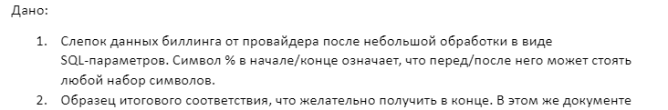
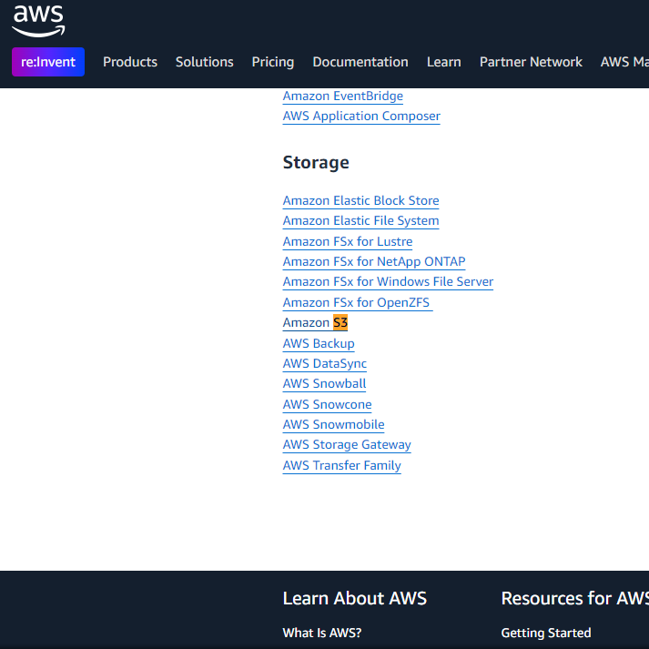
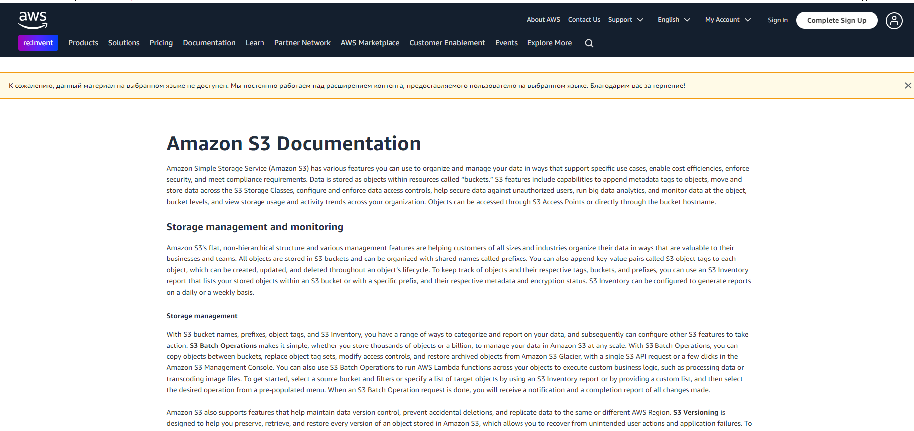
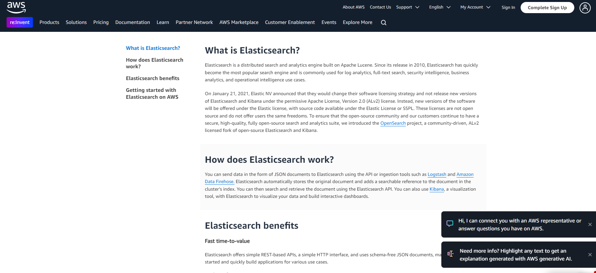
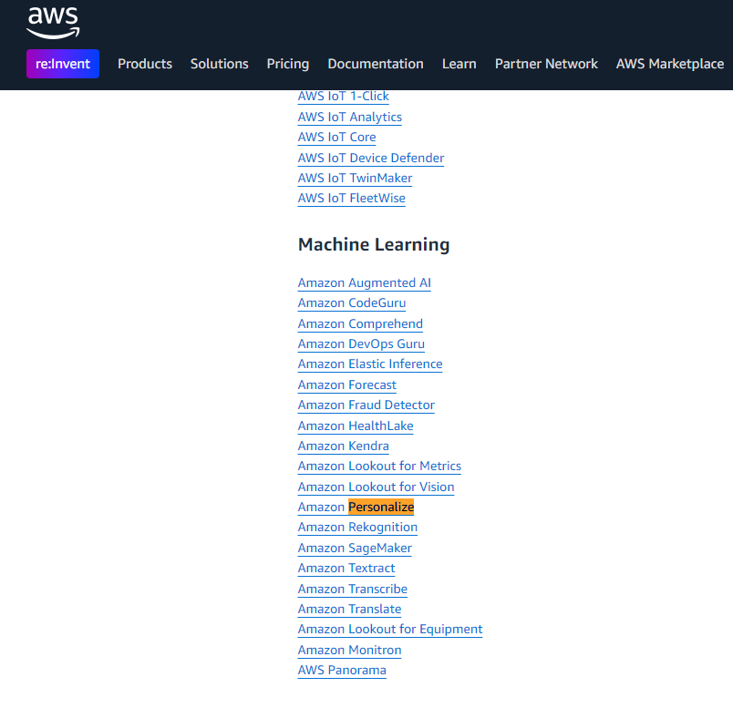
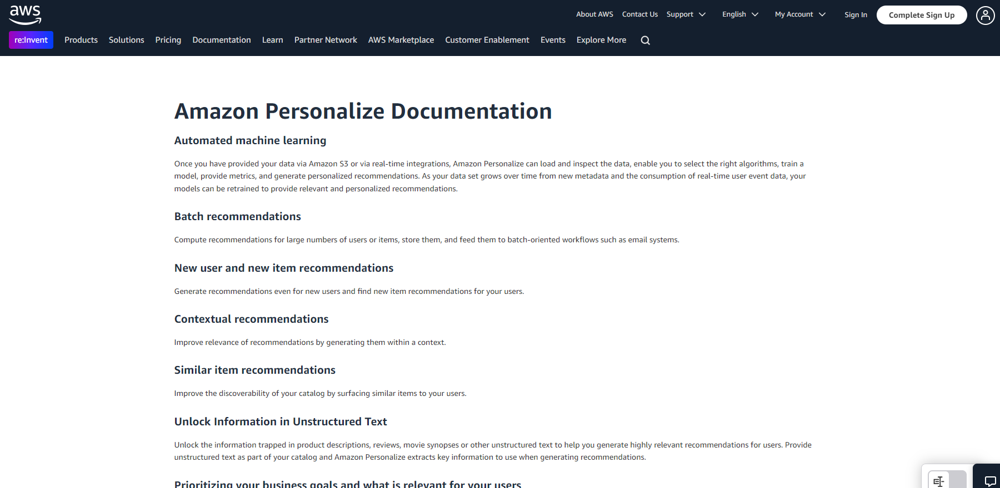

<h1 style="text-align: center">Отчет</h1>

<h2>
Лабораторная работа 1. Знакомство с IaaS, PaaS, SaaS сервисами в облаке на примере Amazon Web Services (AWS). Создание сервисной модели.</h2>

<table style="outline: none; border: 1px solid #ccc">
<tbody>
    <tr>
    <th>Дисциплина</th>
        <td>Облачные технологии и услуги</td>
    </tr>
    <tr style="background: #fff;">
        <th>Обучающиеся</th>
        <td>Тутубалин Кирилл, Москалец Данила, Захматов Юрий</td>
    </tr>
    <tr>
    <th>Учебная группа</th>
        <td>К3241</td>
    </tr>
    <tr>
    <th>Вариант</th>
        <td>7</td>
    </tr>
    </tbody>
</table>

## Задание:

## Дано: 

Вариант 7: <a target='_blank' href='https://drive.google.com/file/d/1NNxGH3oLnrGKkZkdEpX_1UiAQKK0gzMT/view?usp=drive_link'>https://drive.google.com/file/d/1NNxGH3oLnrGKkZkdEpX_1UiAQKK0gzMT/view?usp=drive_link</a>

Образец: <a target="_blank" href='https://drive.google.com/file/d/1NocJXRGEZoTfrsr8DUIY4GCZUAZN08XV/view?usp=drive_link'>https://drive.google.com/file/d/1NocJXRGEZoTfrsr8DUIY4GCZUAZN08XV/view?usp=drive_link</a>

## Ход работы

<!--
<b>Выполненная работа:</b> <a target="_blank" href="https://docs.google.com/spreadsheets/d/1DPtO2PZnmMtCWoN18Gan4RGa-0XnhY77qLefs6m-Lwg/edit?gid=28720847#gid=28720847">https://docs.google.com/spreadsheets/d/1DPtO2PZnmMtCWoN18Gan4RGa-0XnhY77qLefs6m-Lwg/edit?gid=28720847#gid=28720847</a>
-->

<b>Выполненная работа:</b> 

https://docs.google.com/spreadsheets/d/1DPtO2PZnmMtCWoN18Gan4RGa-0XnhY77qLefs6m-Lwg/edit?gid=28720847#gid=28720847' src='assets/screen.png'>

<b>Источник:</b> <a target="_blank" href='https://aws.amazon.com/ru/documentation-overview/?nc2=h_ql_doc_do'>AWS Documentation Overview</a>

### Ход выполнения лабораторной работы

Сначала мы проанализировали исходные данные, что вообще обозначают стоблцы в колонках:

<ul>
<li>Product Code: код продукта, указывающий на конкретный сервис AWS</li>
<li>Usage Type: тип использования ресурса, детиализирующая специфику потребления (например, объём хранилища, количество операций, вычислительные ресурсы и тд)</li>
<li>lineItem/Operation: конкретная операция или метрика использования сервиса</li>
<li>lineItem/LineItemDescription: описание услуги в счёте, предоставленное провайдером</li>
</ul>

Далее проанализоровали что от нас собственно требуется, что обозначают данные столбцы, 

<ul>
<li>IT Tower:  основная категория (например, Cloud Services, Storage, Search & Analytics и тд)</li>
<li>Service Family: семейство сервисов (например, Analytics, Storage&Content Delivery и тд)</li>
<li>Service Type: тип услуги (например, AmazonS3, AmazonMSK и тд)</li>
<li>Service Sub Type: подтип услуги (например, Data Retrieval, Data Transfer и тд) </li>
<li>Service Usage Type: способ использования (например, Requests, Early Delete Fee и тд)</li>
</ul>

Для классификации сервисов мы обратились к документации AWS <a target="_blank" href='https://aws.amazon.com/ru/documentation-overview/?nc2=h_ql_doc_do'>AWS Documentation Overview</a>  Сопоставили данные из столбцов Usage Type и lineItem/Operation с категориями из документации.

Для выделения классов и дальнешйей сортирвоки выделели It Towers по цветам (Здесь подсмотрели, как сделали наши коллеги)  

#### Конкретные примеры

<b>Пример 1:</b>

- Product Code: AmazonS3 указывает на сервис хранения данных Amazon S3
- Usage Type: TimedStorage-ByteHrs обозначает использование хранилища, измеряемое в байт-часах
- lineItem/Operation: 
- lineItem/LineItemDescription: 

- IT Tower: Storage
- Service Family: Storage&Content Delivery
- Service Type: Amazon S3
- Service Sub Type: Timed Storage TimedStorage-ByteHrs указывает на измерение использования хранилища во времени, в частности в "байт-часах". Поэтому подтип сервиса логично определить как "Timed Storage"
- Service Usage Type: Timed Storage  описывает тип потребления ресурса - использование хранилища, измеряемое по времени.

<b>Пример 2:</b>

- Product Code: AmazonES сервис Amazon Elasticsearch Service
- Usage Type: 
- lineItem/Operation: 
- lineItem/LineItemDescription: Tax% строка расходов связана с налогами

- IT Tower:  Search & Analytics  Product Code: AmazonES указывает на Amazon Elasticsearch Service, который относится к категории сервисов для поиска и аналитики
- Service Family: Search & Analytics  Service Family должен уточнять общее семейство, к которому относится сервис. Elasticsearch является частью сервисов поиска и аналитики в AWS 
- Service Type: AmazonES  Какой именно сервис используется в рамках семейства
- Service Sub Type: Additional Costs lineItem/LineItemDescription: Tax% указывает на дополнительные расходы, связанные с налогами. Такие затраты не относятся к основному функционалу сервиса (поиск или аналитика), а являются дополнительными
- Service Usage Type: Tax lineItem/LineItemDescription: Tax% прямо указывает, что речь идет о налогах 

<b>Пример 3:</b>

- Product Code: AmazonPersonalize Сервис для рекомендаций на основе машинного обучения
- Usage Type: %TrainingHour Использование ресурсов для обучения модели, измеряется в часах.
- lineItem/Operation: 
- lineItem/LineItemDescription: 

- IT Tower:  Cloud Services Сервис Amazon Personalize относится к категории облачных сервисов, так как это управляемое решение AWS для работы с моделями машинного обучения
- Service Family: Artificial Intelligence  Amazon Personalize - это сервис для построения рекомендаций на основе машинного обучения, который относится к сфере искусственного интеллекта
- Service Type: AmazonPersonalize Какой именно сервис используется в рамках семейства 
- Service Sub Type: Model Training Usage Type: %TrainingHour указывает на использование времени для обучения моделей. Следовательно, подтип сервиса связан с процессом обучения модели (Model Training)
- Service Usage Type: Model Training Использование ресурсов явно указывает на обучение модели. Поэтому это значение перенесено в Service Usage Type для отражения типа нагрузки

### Описание сервисов
1. <b>Amazon Macie</b>
Сервис для обнаружения, классификации и защиты конфиденциальных данных с использованием машинного обучения.

2. <b>Amazon MSK (Managed Streaming for Apache Kafka)</b>
Услуга управляемого Apache Kafka для обработки потоков данных в реальном времени с минимальными накладными расходами на управление.

3.  <b>Amazon Polly</b>
Сервис преобразования текста в речь, позволяющий создавать приложения с голосовым интерфейсом.

4. <b>Amazon Personalize</b>
Сервис для создания персонализированных рекомендаций с использованием технологий машинного обучения, которые используют Amazon.

5. <b>Amazon S3 (Simple Storage Service)</b>
Масштабируемое и безопасное облачное хранилище данных для резервного копирования, архивирования и использования в приложениях.

6. <b>Amazon ES (Elasticsearch Service)</b>
Управляемый сервис для аналитики и поиска данных с возможностями мониторинга и визуализации через Kibana.

## Вывод

 В ходе выполнения лабораторной работы мы изучили принципы классификации облачных сервисов AWS (IaaS, PaaS, SaaS) и распределили их по категориям IT Tower и Service Family. Разобрались в функционале сервисов Amazon Macie, MSK, Polly, Personalize, S3 и ES.
