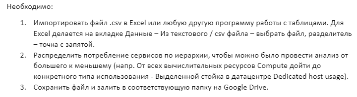

<h1 style="text-align: center">Отчет</h1>

<h2>
Лабораторная работа 1. Знакомство с IaaS, PaaS, SaaS сервисами в облаке на примере Amazon Web Services (AWS). Создание сервисной модели.</h2>

<table style="outline: none; border: 1px solid #ccc">
<tbody>
    <tr>
    <th>Дисциплина</th>
        <td>Облачные технологии и услуги</td>
    </tr>
    <tr style="background: #fff;">
        <th>Обучающиеся</th>
        <td>Тутубалин Кирилл, Москалец Данила, Захматов Юрий</td>
    </tr>
    <tr>
    <th>Учебная группа</th>
        <td>К3241</td>
    </tr>
    <tr>
    <th>Вариант</th>
        <td>7</td>
    </tr>
    </tbody>
</table>

## Задание:

## Дано: 

Вариант 7: <a target='_blank' href='https://drive.google.com/file/d/1NNxGH3oLnrGKkZkdEpX_1UiAQKK0gzMT/view?usp=drive_link'>https://drive.google.com/file/d/1NNxGH3oLnrGKkZkdEpX_1UiAQKK0gzMT/view?usp=drive_link</a>

Образец: <a target="_blank" href='https://drive.google.com/file/d/1NocJXRGEZoTfrsr8DUIY4GCZUAZN08XV/view?usp=drive_link'>https://drive.google.com/file/d/1NocJXRGEZoTfrsr8DUIY4GCZUAZN08XV/view?usp=drive_link</a>

## Ход рабрты

Выполненная работа: <a target="_blank" href="https://docs.google.com/spreadsheets/d/1DPtO2PZnmMtCWoN18Gan4RGa-0XnhY77qLefs6m-Lwg/edit?gid=28720847#gid=28720847">https://docs.google.com/spreadsheets/d/1DPtO2PZnmMtCWoN18Gan4RGa-0XnhY77qLefs6m-Lwg/edit?gid=28720847#gid=28720847</a>

## Вывод

...

