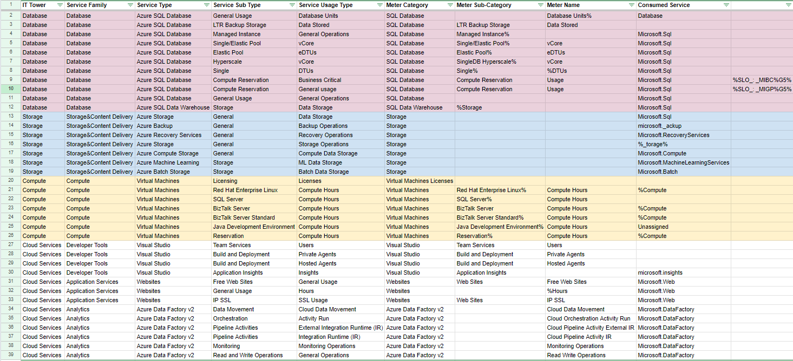

<h1 style="text-align: center">Отчет</h1>

<h2>
Лабораторная работа 2. Сравнение сервисов Amazon Web Services и Microsoft Azure. Создание единой кросс-провайдерной сервисной модели.
</h2>

<table style="outline: none; border: 1px solid #ccc">
<tbody>
    <tr>
    <th>Дисциплина</th>
        <td>Облачные технологии и услуги</td>
    </tr>
    <tr style="background: #fff;">
        <th>Обучающиеся</th>
        <td>Тутубалин Кирилл, Москалец Данила, Захматов Юрий</td>
    </tr>
    <tr>
    <th>Учебная группа</th>
        <td>К3241</td>
    </tr>
    <tr>
    <th>Вариант</th>
        <td>7</td>
    </tr>
    </tbody>
</table>

## Задание:

## Дано: 

Данные лабораторной работы 1: <a target="_blank" href='https://github.com/dany217mk/itmo-devops-cloud-labs/blob/main/AWS/Report.md'>https://github.com/dany217mk/itmo-devops-cloud-labs/blob/main/AWS/Report.md</a>

Вариант 7: <a target="_blank" href='https://drive.google.com/file/d/1b5wWQw70PJ5vjM0xDOWBXRSA_GN204SR/view?usp=drive_link'>https://drive.google.com/file/d/1b5wWQw70PJ5vjM0xDOWBXRSA_GN204SR/view?usp=drive_link</a>

Образец: <a target="_blank" href='https://drive.google.com/file/d/1NocJXRGEZoTfrsr8DUIY4GCZUAZN08XV/view?usp=drive_link'>https://drive.google.com/file/d/1NocJXRGEZoTfrsr8DUIY4GCZUAZN08XV/view?usp=drive_link</a>

## Ход работы

<!--
Выполненная работа: <a target="_blank" href="https://docs.google.com/spreadsheets/d/1dSqh0L-ptrkUvfCBzG0Qu_jR81TVgg8G6D6ZNOXBVZE/edit?gid=492535656#gid=492535656">https://docs.google.com/spreadsheets/d/1dSqh0L-ptrkUvfCBzG0Qu_jR81TVgg8G6D6ZNOXBVZE/edit?gid=492535656#gid=492535656</a>
-->

<b>Выполненная работа:</b> 

<b>Источник:</b> <a target="_blank" href='https://aws.amazon.com/ru/documentation-overview/?nc2=h_ql_doc_do'>Azure documentation</a>

### Описание сервисов
1. <b>Azure SQL Database</b>
Это управляемая облачная реляционная база данных, обеспечивающая автоматическое резервное копирование, масштабируемость и встроенные функции безопасности. Она используется для работы с транзакционными данными и управления структурированными данными.

2. <b>Azure SQL Data Warehouse</b>
Аналитическое хранилище данных, оптимизированное для работы с большими объемами информации. Оно используется для сложной аналитики и обработки запросов в рамках интеграции данных.

3. <b>Azure Storage</b>
Облачный сервис хранения данных, который поддерживает блоб-хранилище, файловую систему и очереди сообщений. Подходит для работы с большими объемами файлов и резервного копирования.

4. <b>Azure Backup</b>
Решение для автоматического создания и хранения резервных копий данных. Оно обеспечивает защиту информации от потери и возможность быстрого восстановления.

5. <b>Azure Recovery Services</b>
Сервис для восстановления данных и обеспечения отказоустойчивости систем. Подходит для настройки аварийного восстановления и защиты инфраструктуры.

6. <b>Azure Compute Storage</b>
Компонент, предоставляющий вычислительные ресурсы для хранения и обработки данных в облаке. Используется в сценариях интенсивных вычислений.

7. <b>Azure Machine Learning</b>
Инструмент для разработки, тренировки и развертывания моделей машинного обучения. Поддерживает анализ данных и прогнозирование.

8. <b>Azure Batch Storage</b>
Сервис, используемый для пакетной обработки больших объемов данных и поддержки сложных вычислений.

9. <b>Virtual Machines</b>
Виртуальные машины, предоставляющие вычислительные ресурсы с возможностью настройки операционной системы и программного обеспечения для работы в облаке.

10. <b>Visual Studio</b>
Инструмент для разработки и деплоя приложений, интегрированный с облачными сервисами. Поддерживает широкий спектр языков программирования.

11. <b>Websites</b>
Платформа для размещения и управления веб-приложениями, обеспечивающая масштабируемость и интеграцию с другими сервисами Azure.

12. <b>Azure Data Factory v2</b>
Сервис для интеграции и преобразования данных. Позволяет автоматизировать процессы перемещения данных между различными источниками.

## Вывод

В ходе выполнения лабораторной работы были изучены принципы классификации облачных сервисов Microsoft Azure и их распределение по категориям IT Tower и Service Family. Разобрались в функционале сервисов Azure SQL Database, Azure Storage, Azure Machine Learning, Virtual Machines и Azure Data Factory v2.
