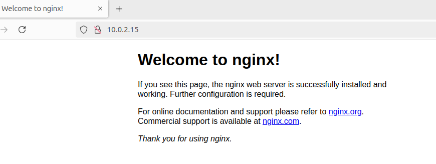
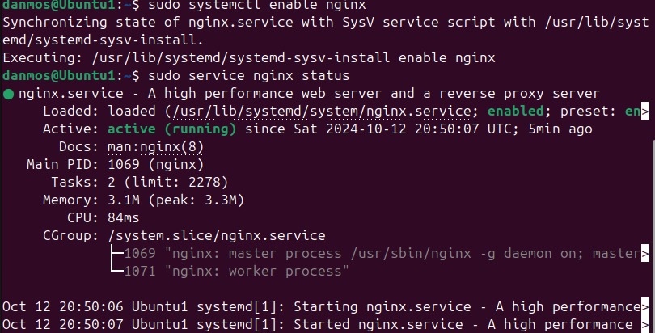
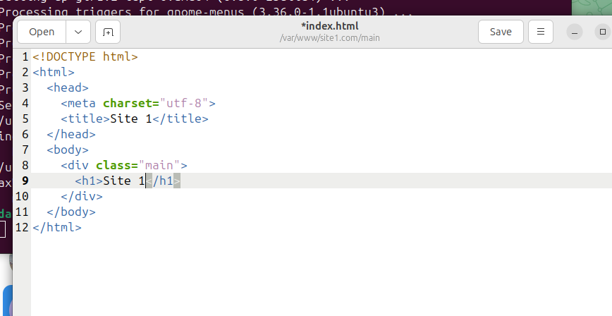
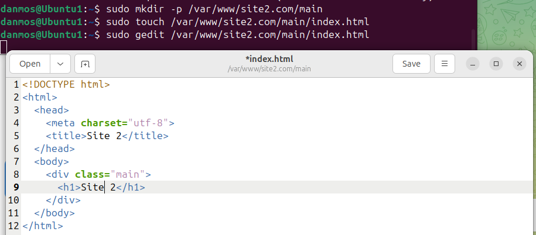
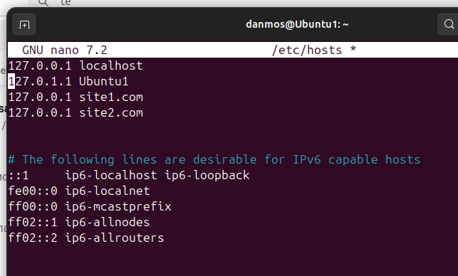
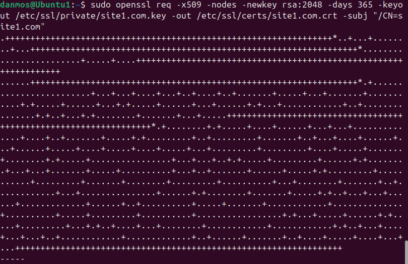
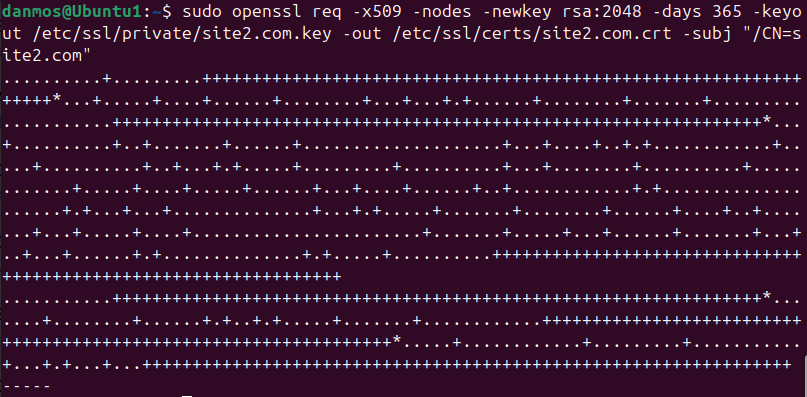
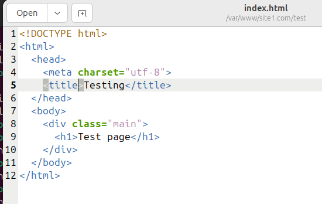
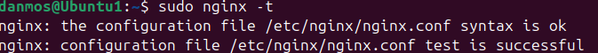

# 1 Лабораторная
## Требования. Настроить nginx по заданному тз:
- Должен работать по https c сертификатом
- Настроить принудительное перенаправление HTTP-запросов (порт 80) на HTTPS (порт 443) для обеспечения безопасного соединения.
- Использовать alias для создания псевдонимов путей к файлам или каталогам на сервере.
- Настроить виртуальные хосты для обслуживания нескольких доменных имен на одном сервере.

## Ход выполнения
### 1. Уставнока ngnix. Проверка
```
sudo apt update
sudo apt install nginx
```
<p>Проверям, что все в порядке:</p>
<br>
<br>
<br>

### 2. Создание виртуальных хостингов
Создаем папку для виратульных хостингов, доавляем файл index.html, прописываем простейший html файл
```
sudo mkdir -p /var/www/site1.com/main
sudo touch /var/www/site1.com/main/index.html
sudo gedit /var/www/site1.com/main/index.html
```
<br>
<p>Тоже самое, но теперь для site2.com</p>
<br>

<p>Теперь в hosts прописываем домены данных виртуальных хостингов: </p>

```
sudo nano /etc/hosts/
```


### 3. Генерация самоподписанного сертификата
<p>Генерируем самоподписанный сертификат с помощью OpenSSL:</p>

```
sudo openssl req -x509 -nodes -newkey rsa:2048 -days 365 -keyout /etc/ssl/private/site1.com.key -out /etc/ssl/certs/site1.com.crt -subj "/CN=site1.com"
```

<p>тоже самое для второго</p>

<p>При использовании самоподписанных сертификатов браузеры будут предупреждать, что соединение небезопасно, так как сертификат не подтверждён доверенным центром сертификации. Это ожидаемое поведение при самоподписанных сертификатах.</p>

### 4. Настройка конфигарации виртуальных хостов.
```
sudo nano /etc/nginx/sites-available/site1.com
```
#### 4.1 Настройка перенаправления HTTP на HTTPS:
```
server {
    listen 80;
    server_name site1.com;
    return 301 https://$host$request_uri;
}
```
#### 4.2 Настройка виртуальных хостов с использованием HTTPS
```
server {
    listen 443 ssl;
    server_name site1.com;

    ssl_certificate /etc/ssl/certs/site1.com.crt;
    ssl_certificate_key /etc/ssl/private/site1.com.key;

    location / {
        root /var/www/site1.com/main;
        index index.html;
    }
}
```
<p>Тоже самое для виртуального хостинга</p>


### 5. Alias
<p>Для виртуального хостинга <i>site1.com</i> добавляем каталог test, создаем файл index.html</p>

```
sudo mkdir -p /var/www/site1.com/test
sudo touch /var/www/site1.com/test/index.html
sudo gedit /var/www/site1.com/test/index.html
```

<p><b>Настраиваем файл конфигурации</b></p>

```
server {
    listen 443 ssl;
    server_name site1.com;

    ssl_certificate /etc/ssl/certs/site1.com.crt;
    ssl_certificate_key /etc/ssl/private/site1.com.key;

    location / {
        root /var/www/site1.com/main;
        index index.html;
    }
    location /test {
        alias /var/www/site1.com/test;
        index index.html
    }
}
```

### 6. Запуск
<p>Создание симлинков для включения конфигураций</p>

```
sudo ln -s /etc/nginx/sites-available/site1.com /etc/nginx/sites-enabled/
sudo ln -s /etc/nginx/sites-available/site2.com /etc/nginx/sites-enabled/
```
<p>Перезапуск Nginx. Проверка конфигурации</p>

```
sudo systemctl restart nginx
sudo nginx -t
```
