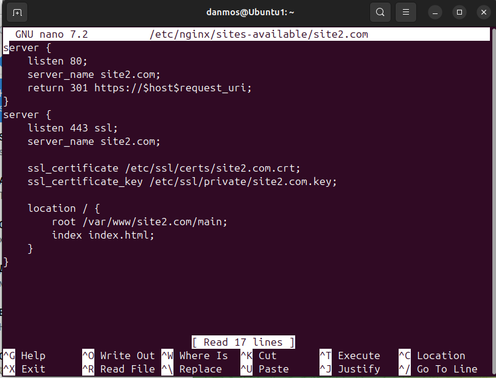

# 1 Лабораторная
## Требования. Настроить nginx по заданному тз:
- Должен работать по https c сертификатом
- Настроить принудительное перенаправление HTTP-запросов (порт 80) на HTTPS (порт 443) для обеспечения безопасного соединения.
- Использовать alias для создания псевдонимов путей к файлам или каталогам на сервере.
- Настроить виртуальные хосты для обслуживания нескольких доменных имен на одном сервере.

## Ход выполнения
### 1. Уставнока ngnix. Проверка
```
sudo apt update
sudo apt install nginx
```
<p>Проверям, что все в порядке:</p>
<br>
<br>
<br>

### 2. Создание проектов
Создаем папку для наших проектов, доавляем файл index.html, прописываем простейший html файл
```
sudo mkdir -p /var/www/site1.com/main
sudo touch /var/www/site1.com/main/index.html
sudo gedit /var/www/site1.com/main/index.html
```
<br>
<p>Тоже самое, но теперь для site2.com</p>
<br>

<p>Теперь в hosts прописываем домены наших сайтов: </p>

```
sudo nano /etc/hosts/
```


### 3. Генерация самоподписанного сертификата
<p>Генерируем самоподписанный сертификат с помощью OpenSSL:</p>

```
sudo openssl req -x509 -nodes -newkey rsa:2048 -days 365 -keyout /etc/ssl/private/site1.com.key -out /etc/ssl/certs/site1.com.crt -subj "/CN=site1.com"
```

<p>тоже самое для второго</p>

<p>При использовании самоподписанных сертификатов браузеры будут предупреждать, что соединение небезопасно, так как сертификат не подтверждён доверенным центром сертификации. Это ожидаемое поведение при самоподписанных сертификатах.</p>

### 4. Настройка конфигурации
```
sudo nano /etc/nginx/sites-available/site1.com
```
#### 4.1 Настройка перенаправления HTTP на HTTPS:
```
server {
    listen 80;
    server_name site1.com;
    return 301 https://$host$request_uri;
}
```
<p>listen 80; — Указывает серверу слушать HTTP-запросы на порту 80 (стандартный порт для HTTP).<br>
return 301 https://$host$request_uri; — Выполняет перенаправление всех запросов с HTTP на HTTPS (статус код 301 — постоянное перенаправление). $host — это текущий домен, а $request_uri — полный путь запроса </p>

#### 4.2 Настройка конфигурации с использованием HTTPS
```
server {
    listen 443 ssl;
    server_name site1.com;

    ssl_certificate /etc/ssl/certs/site1.com.crt;
    ssl_certificate_key /etc/ssl/private/site1.com.key;

    location / {
        root /var/www/site1.com/main;
        index index.html;
    }
}
```
<p>
listen 443 ssl;: Указывает, что сервер должен слушать порт 443, который используется для зашифрованных HTTPS-соединений.  ssl говорит Nginx, что для обработки запросов нужно использовать SSL для шифрования трафика.<br>

ssl_certificate /etc/ssl/certs/site1.com.crt;: Указывает путь к файлу SSL-сертификата для этого домена.<br>

ssl_certificate_key /etc/ssl/private/site1.com.key;: Указывает путь к приватному ключу, который используется в паре с сертификатом. <br>

location / { ... }: Блок location определяет, как Nginx должен обрабатывать запросы для определённых путей. <br>

root /var/www/site1.com/main;: Указывает корневую директорию, из которой Nginx будет загружать файлы для этого сайта.
</p>
<p>Тоже самое для второго</p>


### 5. Alias
<p>Для проекта <i>site1.com</i> добавляем каталог test, создаем файл index.html</p>

```
sudo mkdir -p /var/www/site1.com/test
sudo touch /var/www/site1.com/test/index.html
sudo gedit /var/www/site1.com/test/index.html

```

<p><b>Настраиваем файл конфигурации</b></p>

```
sudo nano /etc/nginx/sites-available/site1.com
```
```
server {
    listen 443 ssl;
    server_name site1.com;

    ssl_certificate /etc/ssl/certs/site1.com.crt;
    ssl_certificate_key /etc/ssl/private/site1.com.key;

    location / {
        root /var/www/site1.com/main;
        index index.html;
    }
    location /test {
        alias /var/www/site1.com/test;
        index index.html;
    }
}
```

### 6. Запуск
<p>Создание симлинков для включения конфигураций</p>

```
sudo ln -s /etc/nginx/sites-available/site1.com /etc/nginx/sites-enabled/
sudo ln -s /etc/nginx/sites-available/site2.com /etc/nginx/sites-enabled/
```
<p>Перезапуск Nginx. Проверка конфигурации</p>

```
sudo systemctl restart nginx
sudo nginx -t
```


### 7. Проверка


### 8. Итоги
<p>Сервер настроен на работу с HTTPS для двух доменов с самоподписанным сертификатом, перенаправлением HTTP на HTTPS, и алиасами для директорий (test).</p>