# 2 Лабораторная со звездочкой
## Требования. 
1. Написать “плохой” Docker compose файл, в котором есть не менее трех “bad practices” по их написанию
2. Написать “хороший” Docker compose файл, в котором эти плохие практики исправлены
3. В Readme описать каждую из плохих практик в плохом файле, почему она плохая и как в хорошем она была исправлена, как исправление повлияло на результат
4. После предыдущих пунктов в хорошем файле настроить сервисы так, чтобы контейнеры в рамках этого compose-проекта так же поднимались вместе, но не "видели" друг друга по сети. В отчете описать, как этого добились и кратко объяснить принцип такой изоляции
## Ход работы.
### 1. Создаем плохой composefile
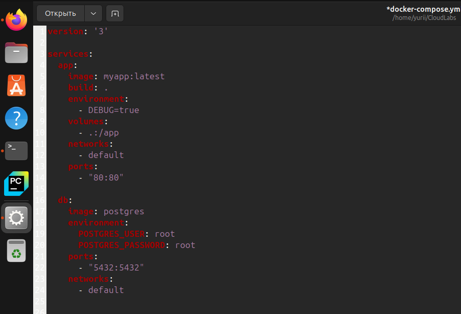
#### 1.1 Использование latest для образа

Указание latest для образа делает сборку нестабильной, поскольку с каждым запуском может быть загружена новая версия образа, что приведет к непредсказуемому поведению.

#### 1.2 Использование секретов в открытом виде
Пароль от базы данных и имя пользователя прописаны в явном виде в Compose-файле. Это небезопасно и может привести к утечке данных.

#### 1.3 Монтирование всей директории проекта как volume:

Монтирование (связь файловой системы хоста и приложения) всей рабочей директории (.) внутрь контейнера создает проблемы с производительностью и безопасностью, так как файлы с хоста могут случайно изменить поведение приложения.

#### 1.4 Все контейнеры находятся в одной сети (default) 
Это означает, что они могут видеть друг друга и взаимодействовать по сети. Это может привести к потенциальным рискам безопасности, так как доступ к базе данных, например, может быть не нужен приложениям, но он доступен всем сервисам в сети.


### 2. Создаем хороший composefile
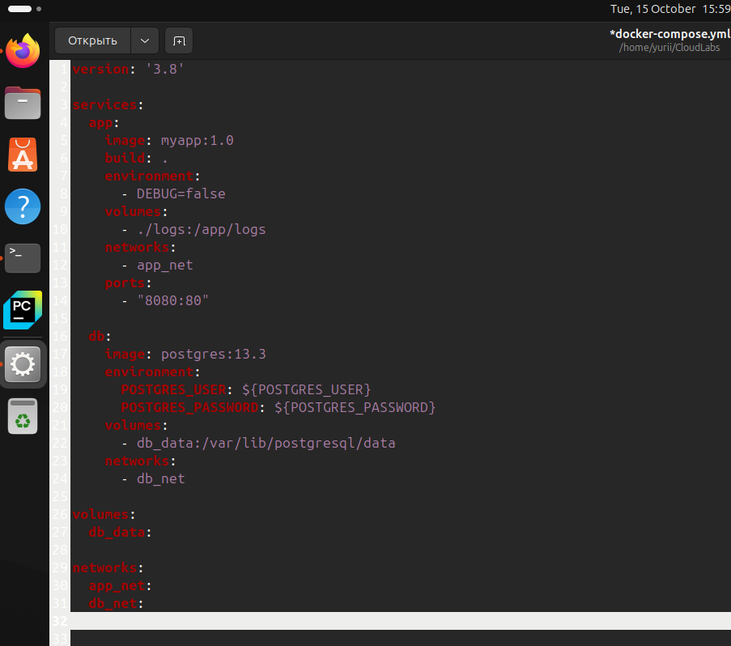
#### 2.1 Используем конкретную версию для образа
```
image: myapp:1.0
image: postgres:13.3
```
Так мы гарантируем поведение приложения. 

#### 2.2 Используем <mark style='background: #ccc; border: 2px solid #ccc; border-radius: 8px; padding: 2px 4px;'>.env</mark> для хранения секретов
```
environment:
  POSTGRES_USER: ${POSTGRES_USER}
  POSTGRES_PASSWORD: ${POSTGRES_PASSWORD}
```
Сохраняем секреты в <mark style='background: #ccc; border: 2px solid #ccc; border-radius: 8px; padding: 2px 4px;'>.env</mark> чтобы, в случае утечки кода нас не взломали.

#### 2.3 Нормально все монтируем:
```
volumes:
  - ./logs:/app/logs
```
Тут монтируется только конкретная директория. Это снижает нагрузку на файловую систему и делает контейнер безопаснее.

#### 2.4 Изолируем контейнеры друг от друга 
```
networks:
  app_net:
  db_net:
```
создаем разные сети для разных сервисов. Приложение и база данных находятся в отдельных сетях (app_net и db_net). Это обеспечивает их изоляцию друг от друга, и они не могут взаимодействовать по сети.

### 3. Настройка сервисов 
<p>Для начала создадим простое FastAPI приложение<p>
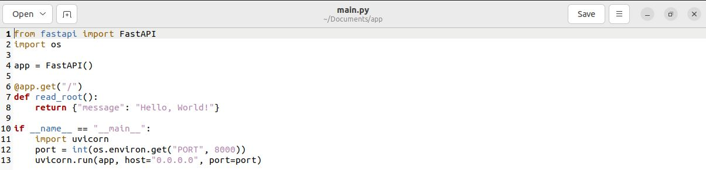
<p>Напишем для него Dockerfile</p>
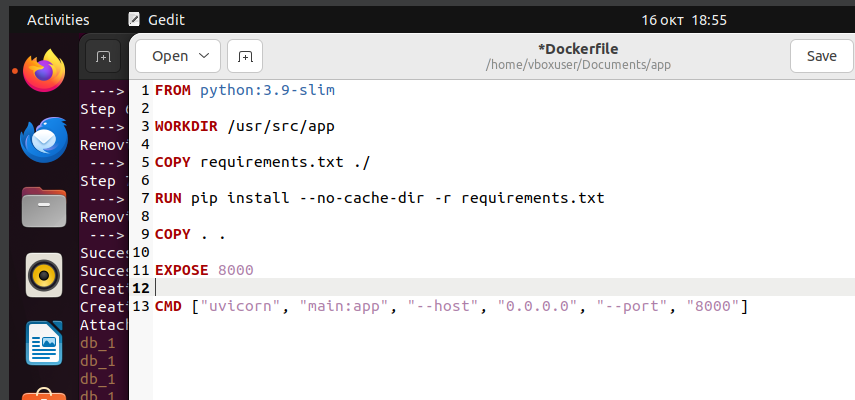
<p>Добавим файлы requirements и .env (для переменных среды под бд)</p>
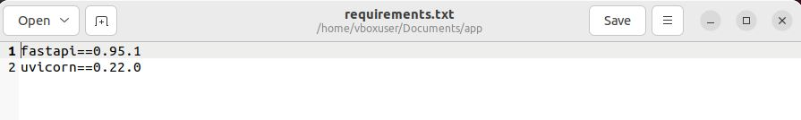
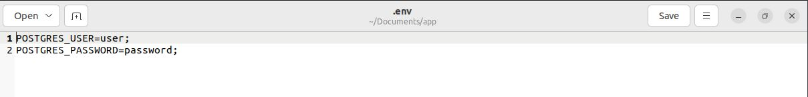
<p>Чутка перепишем наш docker-compose файл</p>
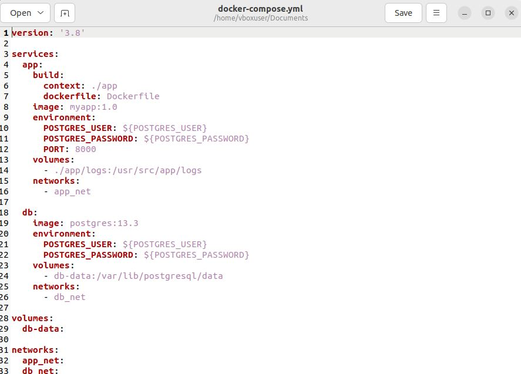
<p>Запустим</p>
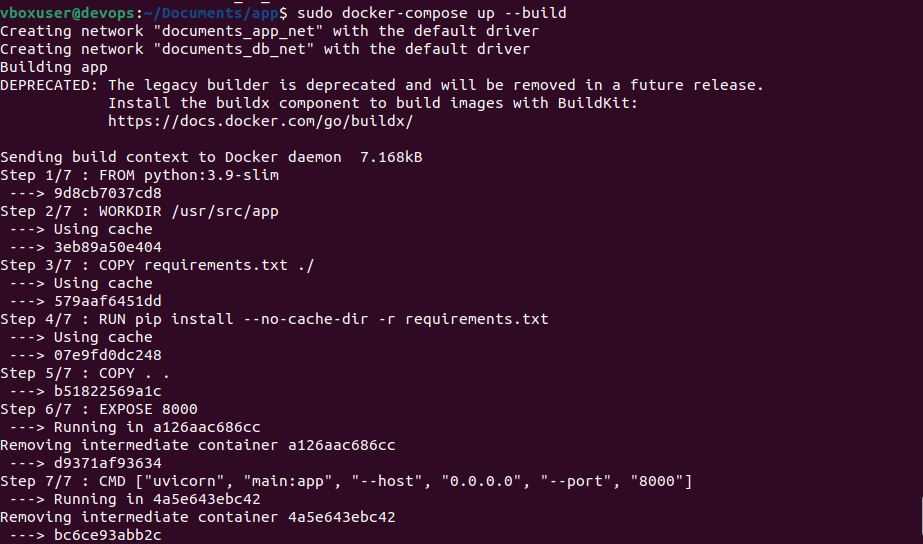
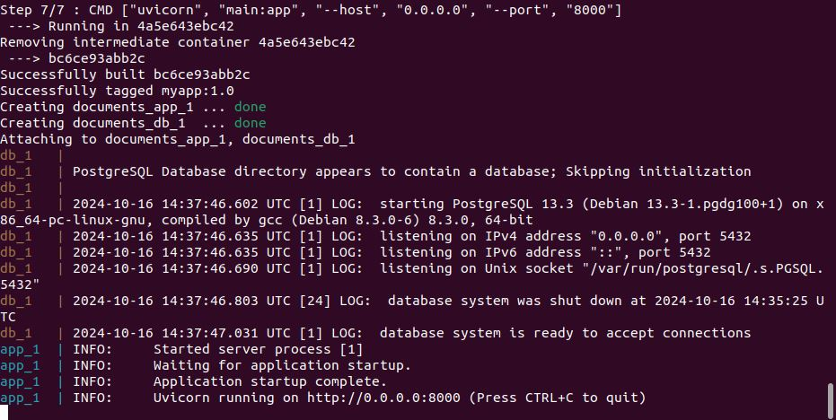
<p>Проверим что все ок</p>

<p>Проверим сети</p>
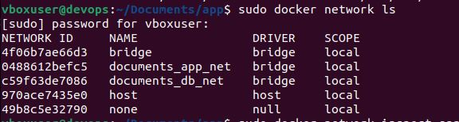
<p>проверим что в каждой сети есть свой контейнер</p>
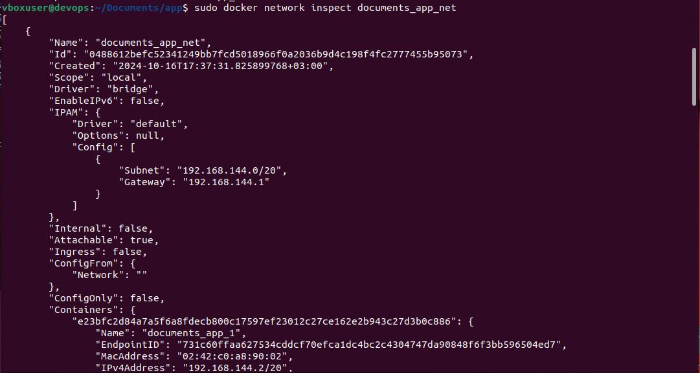
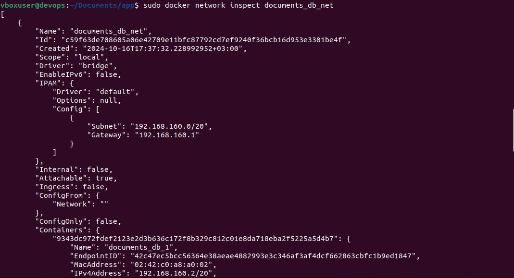

<p>Прицнип такой изоляции</p>
<p>Сети app_net и db_net — это две разные сетевые области, и сервисы, которые подключены к одной из них, не могут взаимодействовать с сервисами из другой. Это гарантирует, что приложение и база данных изолированы на сетевом уровне и не могут отправлять запросы друг другу, пока не будут специально настроены для этого (например, через прокси или внешние сервисы).
Контейнеры по-прежнему будут доступны снаружи (через порты, указанные в ports), но они не видят друг друга внутри сети.</p>

<p>Принцип изоляции контейнеров</p>
<p>Чтобы контейнеры поднимались вместе, но не могли взаимодействовать по сети, в хорошем файле используются отдельные сети для каждого сервиса. Это позволяет каждому сервису быть доступным только для тех контейнеров, которые подключены к той же сети.</p>

