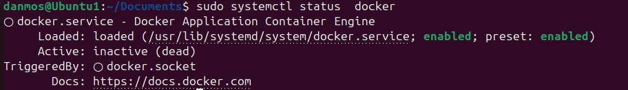
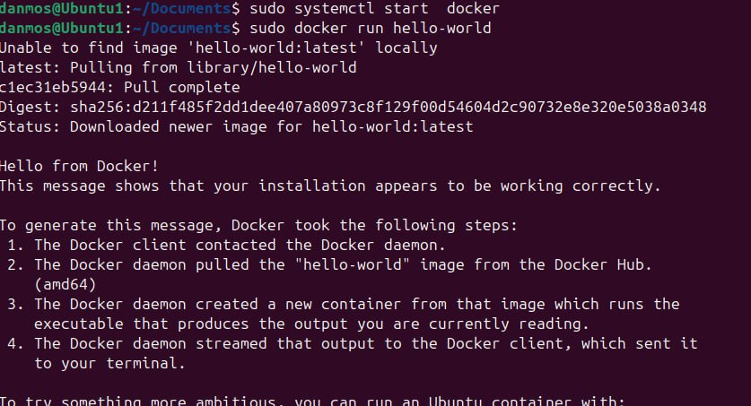
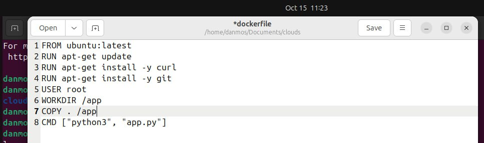
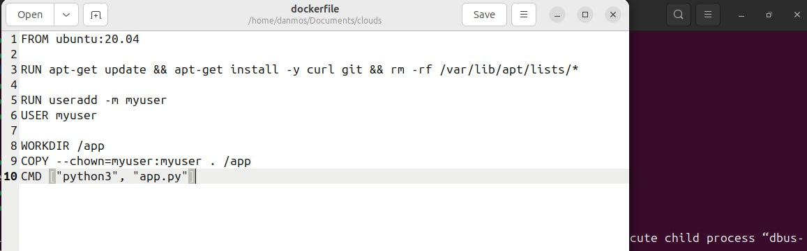

# 2 Лабораторная
## Требования. 
1. Написать “плохой” Dockerfile, в котором есть не менее трех “bad practices” по написанию докерфайлов
2. Написать “хороший” Dockerfile, в котором эти плохие практики исправлены
3. В Readme описать каждую из плохих практик в плохом докерфайле, почему она плохая и как в хорошем она была исправлена, как исправление повлияло на результат
4. В Readme описать 2 плохих практики по работе с контейнерами. ! Не по написанию докерфайлов, а о том, как даже используя хороший докерфайл можно накосячить именно в работе с контейнерами.
## Ход работы.
### 1. Устанавливаем Docker
Обновляем систему
```
sudo apt update
sudo apt upgrade  
```
Создаем необходимые зависимости
```
sudo apt install apt-transport-https ca-certificates curl software-properties-common
```
Добавляем GPG-ключ от докера
```
curl -fsSL https://download.docker.com/linux/ubuntu/gpg | sudo gpg --dearmor -o /usr/share/keyrings/docker-archive-keyring.gpg
```
Добавляем репозиторий Docker в систему
```
echo "deb [arch=amd64 signed-by=/usr/share/keyrings/docker-archive-keyring.gpg] https://download.docker.com/linux/ubuntu $(lsb_release -cs) stable" | sudo tee /etc/apt/sources.list.d/docker.list > /dev/null
```
Устанавливаем Docker
```
sudo apt update
sudo apt install docker-ce docker-ce-cli containerd.io
```
Проверяем что docker работает
```
sudo systemctl status docker
```

Докер установлен, кайфарики, можно и по пиву!
А теперь запустим докер
```
sudo systemctl enable docker
sudo docker run hello-world
```

МЕГА КАЙФАРИКИ! Самое сложное позади...

### 2. Создаем плохой dockerfile

#### 2.1 Использование latest:
Использование latest вместо конкретной версии образа делает контейнер ненадежным, так как последняя версия образа может поменяться и вызывать ошибки.
#### 2.2 Множество RUN команд:
каждое выполнение RUN создает новый слой в образе, что увеличивает размер образа и время сборки.
#### 2.3 Запуск от имени root:
Контейнеры, работающие под root, увеличивают риски безопасности. Если контейнер скомпрометирован, злоумышленник может получить доступ к хост-системе.
#### 2.4 Установка пакетов через apt-get без очистки кеша
В RUN apt-get install -y не очищается кеш apt, что увеличивает размер конечного образа, так как сохраняются временные данные.
#### 2.5 Несоблюдение отступов и пробелов
Для лучшего понимания докерфайла необходимо делать отстпупы.

### 3. Создаем хороший dockerfile

#### 3.1 Ставим конкретную версию ubuntu. 
```
FROM ubuntu:20.04
```
#### 3.2 Обьединяем все RUN команды в одну, уменьшаем кол-во слоев и улушаем производительность
```
RUN apt-get update && apt-get install -y curl git && rm -rf /var/lib/apt/lists/*
```
#### 3.3 Добавляем пользователя без привилегий с помощью useradd и переключаем на него через USER. Это повышает безопасность контейнера
```
RUN useradd -m myuser
USER myuser
```
#### 3.4 Очищаем кеш apt
```
.&& rm -rf /var/lib/apt/lists/*
```
#### 3.5 Добавляем пробелы и отступы для лучшей читаемости кода

### 4. Что там по плохим практикам по работе с контейнерами?
#### 4.1 Отсутствие ограничения ресурсов (CPU и памяти) для контейнеров
По умолчанию Docker контейнеры могут использовать все доступные ресурсы хоста. Если контейнер потребляет слишком много ресурсов (например, из-за неэффективного кода или утечек памяти), это может негативно повлиять на работу других контейнеров или даже всей системы, что может привести к зависанию или перегрузке сервера. 💀💀💀
```
docker run my-container
```

Контейнер будет иметь доступ ко всей памяти и процессору, что потенциально может привести к проблемам с производительностью хост-машины.

Всегда следует задавать ограничения по ресурсам при запуске контейнеров с помощью опций --memory и --cpus.
```
docker run --memory="512m" --cpus="1" mega-crutoi-container
```
Это ограничит контейнер до 512 мб оперативной памяти и 1 процессорного ядра, что предотвращает чрезмерное использование ресурсов и дает компу жить.

#### 4.2 Хранение данных внутри контейнера
По умолчанию данные, созданные внутри контейнера, сохраняются только до тех пор, пока контейнер работает. Как только контейнер удален или пересоздан, все данные теряются. Это делает контейнеры ненадежными для приложений, которые требуют постоянного хранения данных (например, баз данных, логов или конфигураций).

Если запустить контейнер базы данных без томов:
```
docker run my-container-db
```
Все данные, созданные базой данных внутри контейнера, будут потеряны при его перезапуске или пересборке, что критически опасно.

Необходимо использовать Docker Volumes или Bind Mounts для хранения данных вне контейнера. Это позволяет сохранять данные на хостовой машине, даже если контейнер пересоздается. Это гарантирует, что данные будут доступны после перезапуска контейнера и не будут потеряны.