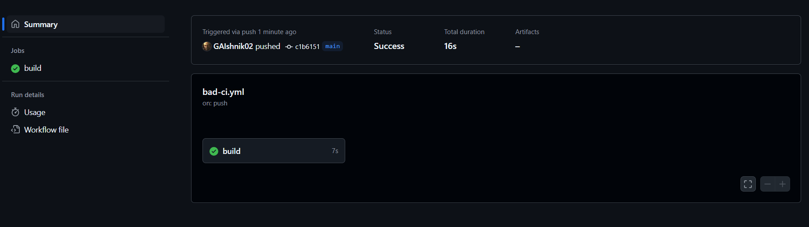

# 3 Лабораторная  
## Требования

1. Написать “плохой” CI/CD файл, который работает, но в нем есть не менее пяти “bad practices” по написанию CI/CD
2. Написать “хороший” CI/CD, в котором эти плохие практики исправлены
3. В Readme описать каждую из плохих практик в плохом файле, почему она плохая и как в хорошем она была исправлена, как исправление повлияло на результат
4. Прочитать историю про Васю (она быстрая, забавная и того стоит): https://habr.com/ru/articles/689234/

# CI/CD это кто?


CI/CD — это способ автоматизировать процесс создания, проверки и доставки кода до пользователей, чтобы все работало быстро и без ошибок. CI (Continuous Integration) — это когда разработчики регулярно добавляют изменения в общий проект, а система автоматически проверяет, не сломалось ли что-то. CD (Continuous Delivery) — это следующий этап, где всё настроено так, чтобы изменения автоматически проходили тесты и могли быть сразу отправлены пользователям. Это как конвейер: написал, проверил, отправил — всё без лишней возни вручную.

## 1. Плохой CI/CD файл  


Мы создадим CI/CD файл с убогими практиками, которые ну вообще не очень.  

```yaml
name: Bad CI/CD!

on:
  push:
    branches:
      - main

jobs:
  build:
    runs-on: ubuntu-latest

    steps:
      - name: Checkout code
        uses: actions/checkout@v2

      - name: Install dependencies
        run: |
          sudo apt-get update
          sudo apt-get install -y python3 python3-pip

      - name: Add test placeholder(та самая заглушка) 
        run: |
          mkdir -p tests
          echo "def test_placeholder(): assert True" > tests/test_placeholder.py
      - name: Run tests
        run: |
          pip install pytest
          pytest tests/

      - name: Build and deploy
        run: |
          echo "Building application..."
          mkdir dist
          cp -r src/* dist/
          echo "Deploying application..."
          echo "Deployed successfully!"
```
### 1.1 Использование ubuntu-latest
Использование ubuntu-latest может привести к проблемам совместимости, так как версия системы может измениться.

### 1.2 Отсутствие версионирования в checkout
Указание только `@v2` вместо конкретной версии может привести к тому, что при изменении самого действия что-то сломается. Лучше явно указать версию или использовать зафиксированный коммит, чтобы всегда получать одинаковый результат.

### 1.3 Неоптимальная установка зависимостей
Использование `apt-get` на каждом запуске — плохая идея, потому что это медленно, и GitHub Actions не сможет закэшировать эти шаги. Из-за этого каждый раз ты теряешь время.

### 1.4 Работа без изоляции
Установка зависимостей и запуск тестов без виртуального окружения `venv` — плохая темка. Это может вызвать конфликты между версиями библиотек, особенно если ты переносишь проект между разными машинами или окружениями.

### 1.5 Все в одном шаге
Сборка и деплой в одном месте — это дурдом какой-то. Если что-то пойдет не так, будет сложно понять, где именно ошибка. Лучше разделять задачи, чтобы каждая выполняла свою функцию.

### 1.6 Нет проверки ошибок
Даже если тесты упадут, пайплайн все равно продолжит работать. Это очень опасно, потому что деплой может произойти с нерабочим кодом. Нужно явно проверять статус каждого шага.

### Проблемы и ошибки при выполнении
В первый раз мы запушили плохой файл на гитхаб и он выдал ошибку:

Это фиксится добавлением `sudo`
####
Далее вылезла ошибка об отсутствии тестиков, мы добавили заглушку.


## 2. Хороший CI/CD файл


Теперь, когда плохой файл готов (запускать его, пожалуй не будем) самое время сделать легендарный, потрясающий, красивейший, хороший CI/CD файл.

```yaml
```

### 2.1 Использование конкректной версии `ubuntu`
 Использована конкректная версия `ubuntu` что исключит конфликты разных версий.

### 2.2 Использование актуальной версии `actions/checkout@v1`
 Использована актуальная версия `actions/checkout@v3`.

### 2.3 Установка Node.js и npm внутри CI/CD пайплайна
 Использован `actions/setup-node@v3` для предварительной настройки Node.js.

### 2.4 Использование `npm ci` вместо `npm install`
 Заменено на `npm ci`, что гарантирует установку зависимостей из `package-lock.json`.

### 2.5 Пропуск тестов
Добавлен этап запуска тестов.

### 2.6 Прямой деплой в production
 Добавлено условие деплоя только из ветки `main` и только при `push` событии.

## З Запускаем темки




